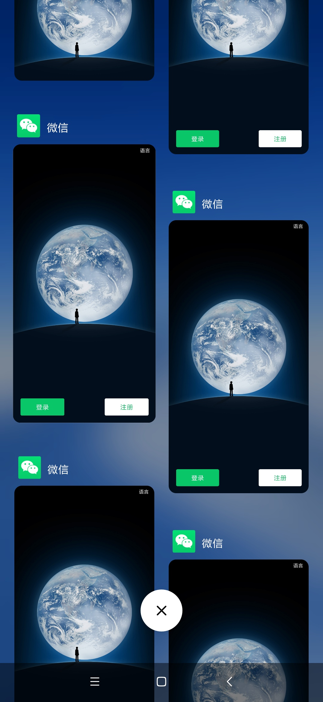
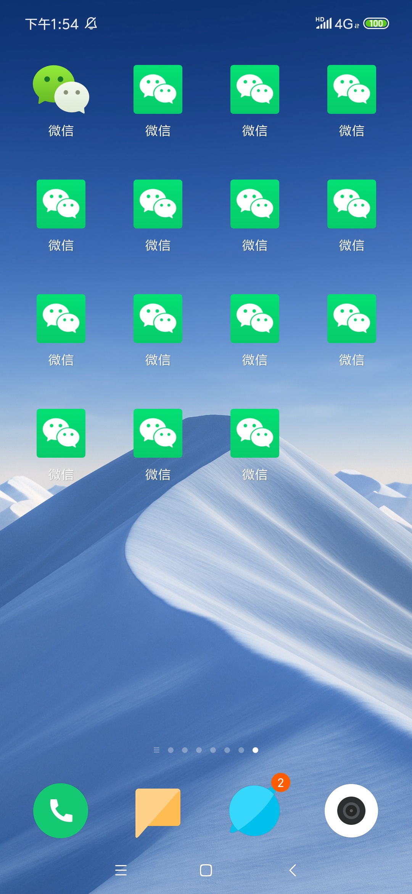

# Zelda

Zelda是一个多开分身的方案，类似VA。不过不会存在对整个Android framework模拟的引擎，Zelda主要还是基于apk改包的思路

Zelda主要基于apk共存原理实现分身，对标MT管理器的apk共存方案

## 使用方法

目前仅支持在Linux like的机器上面构建Zelda,配置好Android环境后，执行脚本``script/dev-zelda.sh`即可

目前zelda有两个构建脚本，分别为：``dev-zelda.sh``和``prod-zelda.sh``,他们分别为开发模式和生产模式，
开发模式不会进行代码优化，混淆保护等，而且输出的app的packageName是固定的，便于调试。
生产模式按照android的标准prod进行构建，且输出pkg不会固定，可以实现apk分身。

也就是说，如果你希望构建多个分身的app，只能使用``prod-zelda.sh`

```
virjar-share:zelda-open virjar$ ./script/prod-zelda.sh ~/Downloads/com.tencent.mm_7.0.10_1580_414ead6cfed19db527894f05ace44702.apk 

> Task :zelda-engine:externalNativeBuildRelease
Build zeldanative armeabi-v7a
ninja: no work to do.

Deprecated Gradle features were used in this build, making it incompatible with Gradle 6.0.
Use '--warning-mode all' to show the individual deprecation warnings.
See https://docs.gradle.org/5.4.1/userguide/command_line_interface.html#sec:command_line_warnings

BUILD SUCCESSFUL in 1s
35 actionable tasks: 4 executed, 31 up-to-date
engineVersionCode: 1.0.0-SNPSHOT
use /Users/virjar/git/zelda/zelda-open/zelda-builder/build/libs/ZeldaBuilder-1.0.0-SNPSHOT.jar
assemble new apk for /Users/virjar/Downloads/com.tencent.mm_7.0.10_1580_414ead6cfed19db527894f05ace44702.apk
zelda build param: -s -w /Users/virjar/.zelda-working /Users/virjar/Downloads/com.tencent.mm_7.0.10_1580_414ead6cfed19db527894f05ace44702.apk
release zelda engine apk into: /Users/virjar/.zelda-working/zelda-engine.apk
edit androidManifest.xml entry
edit resources.arsc entry
build serialNo: zelda_d40e03fe-1fe4-48c3-9d61-9e26bc086e6e
the new apk file ：/Users/virjar/git/zelda/zelda-open/com.tencent.mm_7.0.10_1580_zelda.apk
release zelda default apk signature key into : /Users/virjar/.zelda-working/hermes_key
zip align output apk: com.tencent.mm_7.0.10_1580_zelda.apk
zip align apk with command: /Users/virjar/.zelda-working/zipalign/mac/zipalign -f  4 /Users/virjar/git/zelda/zelda-open/com.tencent.mm_7.0.10_1580_zelda.apk /var/folders/8z/xx0f9f890hz188tb8mdcw23h0000gn/T/zipalign2055468416202243576.apk
/Users/virjar/git/zelda/zelda-open/com.tencent.mm_7.0.10_1580_zelda.apk has been zipalign 
auto sign apk with zelda KeyStore
/Users/virjar/git/zelda/zelda-open/com.tencent.mm_7.0.10_1580_zelda.apk has been Signed
clean working directory..
the final output apk file is :/Users/virjar/git/zelda/zelda-open/com.tencent.mm_7.0.10_1580_zelda.apk
virjar-share:zelda-open virjar$ 

```




# 申明
部分代码使用了asLody的virtualApp(https://github.com/asLody/VirtualApp ),请在VA的许可下使用本项目

# FAQ
部分手机可能构建失败，主要体现在dl_open失败，这是因为dl_open符号hook不完整导致的。如果你遇到某个app在某些手机上面打开闪退，并且有类似如下文案:
``dlopen failed:library "/data/app/xxxx/lib/arm/libxxx.so" not found"``
此时有两中解决方法
### 治标：
https://github.com/virjar/zelda/blob/master/zelda-engine/src/main/java/com/virjar/zelda/engine/fixer/AppBindDataFixer.java#L65
修改为如下代码：
```        String nativeLibraryDir = applicationInfo.nativeLibraryDir;
           fixObjectField(applicationInfo, applicationInfo.getClass());
           //TODO hook linker,to change nativeLibraryDir
           applicationInfo.nativeLibraryDir = nativeLibraryDir;
```
### 治本

从你的手机中，获取linker的二进制
```shel
adb pull /system/bin/linker
```
然后用ida打开linker文件，搜索 dl_open相关符号,然后维护到这里:
https://github.com/virjar/zelda/blob/master/zelda-engine/src/main/cpp/Foundation/IOUniformer.cpp#L642
```
if (findSymbol("__dl__Z9do_dlopenPKciPK17android_dlextinfoPv", "linker",
                       (unsigned long *) &symbol) == 0) {
            MSHookFunction(symbol, (void *) new_do_dlopen_V24,
                           (void **) &orig_do_dlopen_V24);
        } else if (findSymbol("__dl__Z9do_dlopenPKciPK17android_dlextinfoPKv", "linker",
                              (unsigned long *) &symbol) == 0) {
            //小米9,android9
            MSHookFunction(symbol, (void *) new_do_dlopen_V24,
                           (void **) &orig_do_dlopen_V24);
        }// 在这里增加新的符号处理逻辑
}
```
修复好提交一个PR，非常感谢
